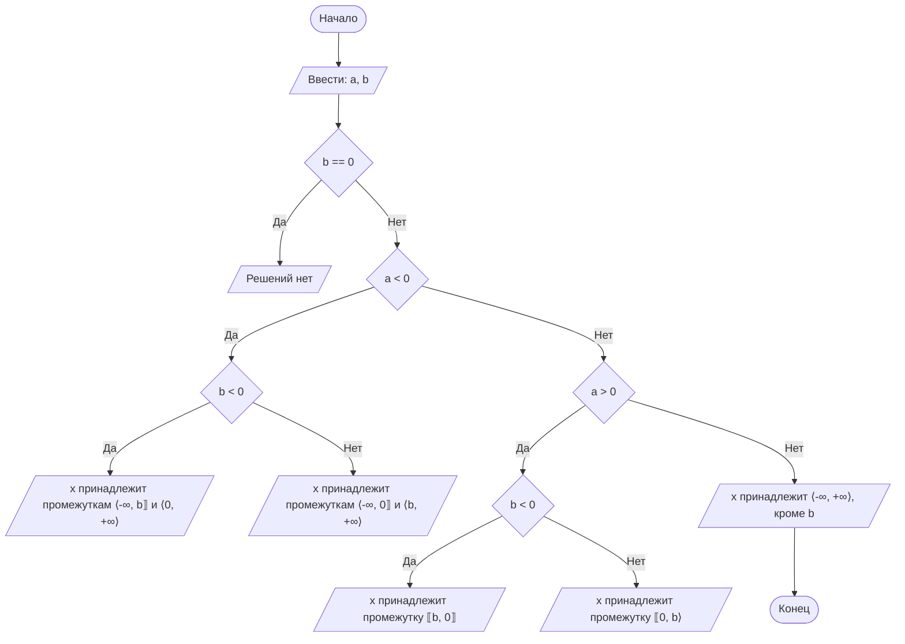

## Отчет по лабораторной работе № 1

#### № группы: `ПМ-2403`

#### Выполнил: `Клевцова Анастасия Эдуардовна`

#### Вариант: `11`

### Cодержание:

- [Постановка задачи](#1-постановка-задачи)
- [Входные и выходные данные](#2-входные-и-выходные-данные)
- [Выбор структуры данных](#3-выбор-структуры-данных)
- [Алгоритм](#4-алгоритм)
- [Программа](#5-программа)
- [Анализ правильности решения](#6-анализ-правильности-решения)

### 1. Постановка задачи

> Дано неравенство ((𝑎*𝑥)/(𝑥 − 𝑏)) ≤ 0. Программа получает на вход два числа 𝑎 и 𝑏 с клавиатуры. Нужно решить неравенство для 𝑥.

Данную задачу можно разделить на 2 подзадачи: найти решение, когда a или b равны нулю и когда a и b не равны нулю.
- Для 1 подзадачи можно рассмотреть 2 случая:
  1. `a == 0`
  2. `b == 0`
- Для 2 подзадачи можно рассмотреть 4 случая
  1. `(a<0) && (b<0)`
  2. `(a<0) && (b>0)`
  3. `(a>0) && (b<0)`
  4. `(a>0) && (b>0)`
Всего надо рассмотреть `2 + 4 = 6` случаев.

### 2. Входные и выходные данные

#### Данные на вход

На вход программа должна получать 2 числа, при этом в условии не сказано, к какому множеству
принадлежать получаемые числа, поэтому будем считать их вещественными.

|             |        Тип         |      min значение     |     max значение     |
|-------------|--------------------|-----------------------|----------------------|
| a (Число 1) | Вещественное число | -1.7*10<sup>308</sup> | 1,7*10<sup>308</sup> |
| b (Число 2) | Вещественное число | -1.7*10<sup>308</sup> | 1,7*10<sup>308</sup> |

#### Данные на выход

Программа должна вывести строку, либо с решением в виде промежутка, либо сообщение о том что решения нет, т.к для данный чисел не существует промежутка 

|                |   Тип  | min значение |    max значение    |
|----------------|--------|--------------|--------------------|
| Cтрока решения | Cтрока |       0      | 2<sup>31</sup> - 1 |

### 3. Выбор структуры данных

Программа получает 2 вещественных числа, не превышающих по модулю 1,7*10<sup>308</sup>. Поэтому для их хранения
можно выделить 2 переменных (`a` и `b`) типа `double`.

|             | название переменной | Тип (в Java) | 
|-------------|---------------------|--------------|
| a (Число 1) | `a`                 | `double`     |
| b (Число 2) | `b`                 | `double`     | 

Для вывода результата необязательно его хранить в отдельной переменной.

### 4. Алгоритм

#### Алгоритм выполнения программы:

1. **Ожидание ввода двух переменных `a` и `b`.**
2. **Условие, проверяющее равно ли `b` нулю. `b` == 0**
  - Если да, переходим к выводу "Решений нет".
  - Если нет, продолжаем дальше.
3. **Условие, проверяющее, меньше ли `a` нуля. `a` < 0**
  - Если да, продолжаем по ветке, связанной с отрицательным значением `a`.
  - Если нет, проверяем другое условие
4. **Проверка `b` < 0, если `a` < 0**
  - Если да, то выводится, что `x` принадлежит промежуткам `(-∞, b] и (0, +∞)`.
  - Если нет, то выводится, что `x` принадлежит промежуткам `(-∞, 0] ∪ (b, +∞)`.
5. **Проверка `a` > 0, если `a` >= 0**
  - Если да, продолжаем проверку.
  - Если нет, то выводится, что x принадлежит `(-∞, +∞)`, кроме `b`.
6. **Проверка `b` < 0, если `a` > 0**
  - Если да, то выводится, что `x` принадлежит промежутку `[b, 0]`
  - Если нет, то выводится, что `x` принадлежит промежутку `[0, b)`

#### Блок-схема

    
### 5. Программа

```java
import java.util.Scanner;

public class Main {
    public static void main(String[] args) {
        Scanner scanner = new Scanner(System.in);

        System.out.print("Введите значение a: ");
        double a = scanner.nextDouble();
        System.out.print("Введите значение b: ");
        double b = scanner.nextDouble();

        if (b == 0) {
            System.out.println("Решений нет");
        } else {
            if (a < 0) {
                if (b < 0) {
                    System.out.println("Решение: x ∈ (-∞, " + b + "] ∪ (0, +∞)");
                } else {
                    System.out.println("Решение: x ∈ (-∞, 0] ∪ (" + b + ", +∞)");
                }
            } else if (a > 0) {
                if (b < 0) {
                    System.out.println("Решение: x ∈ [" + b + ", 0]");
                } else {
                    System.out.println("Решение: x ∈ [0, " + b + ")");
                }
            } else {
                // Если a == 0, это отдельный случай
                System.out.println("Решение: x ∈ (-∞, +∞), кроме " + b);
            }
        }
    }
}
```

### 6. Анализ правильности решения

Программа работает корректно на всем множестве решений с учетом ограничений.

1. Тест на `a > 0 и b > 0`:

    - **Input**:
        ```
        2 и 4
        ```

    - **Output**:
        ```
        x ∈ [0, 4.0)
        ```
2. Тест на `a < 0 и b > 0`:

    - **Input**:
        ```
        -2 и 4
        ```

    - **Output**:
        ```
        x ∈ (-∞, 0] ∪ (4.0, +∞)
        ```
3. Тест на `a > 0 и b < 0`:

    - **Input**:
        ```
        2 и -4
        ```

    - **Output**:
        ```
        x ∈ [-4.0, 0]
        ```
4. Тест на `a < 0 и b < 0`:

    - **Input**:
        ```
        -2 и -4
        ```

    - **Output**:
        ```
        x ∈ (-∞, -4.0] ∪ (0, +∞)
        ```
5. Тест на `a любое и b == 0`:

    - **Input**:
        ```
        2 и 0
        ```

    - **Output**:
        ```
        Решений нет
        ```

6. Тест на `a == 0 и b любое`:

    - **Input**:
        ```
        0 и 4
        ```

